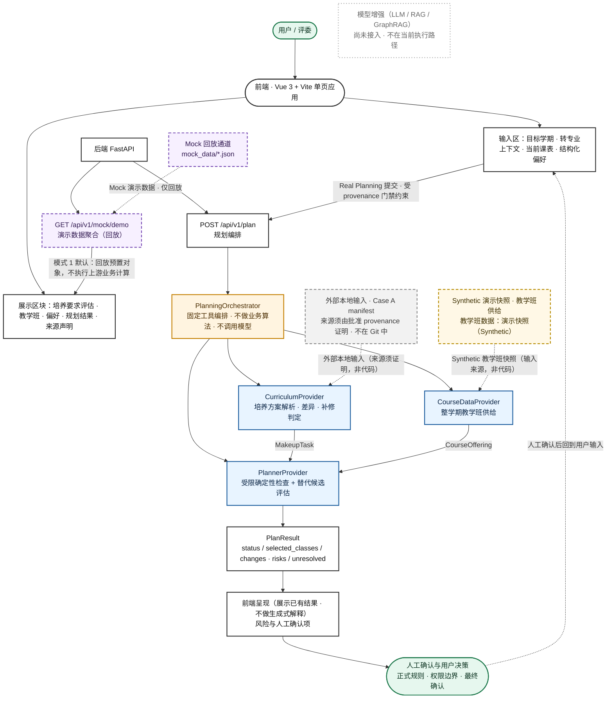

# 学航·转衔 —— 参赛架构图与运行链路说明

> 本文件面向评委与首次接触本项目的读者，用**一张分层图**说明：
> 谁调用谁、每一步的输入输出是什么、哪些环节是**真实执行链路**、
> 哪些环节是**明确标识的演示数据**，以及链路不完整时系统如何**诚实拒绝**。
>
> 契约真源：`schemas/*.schema.json`（公共对象）与 `docs/interfaces/*.md`（Provider 调用边界）。
> 本文件不替代契约，也不描述任何内部实现细节。

---

## 1. 分层架构图



---

## 2. 图例说明

⚠️ 本图用**两条相互独立的轴**着色，⛔ 不得把两者合成一个叫 "Real" 的结论：

| 轴 | 图形 / 样式 | 含义 |
|---|---|---|
| **A. 实际执行的代码** | **实线边框 · 蓝色（`exec` / 实际执行）** | 仓库中真实存在的生产代码确实执行：`CurriculumCaseProvider`、`StoreBackedCourseDataProvider`、`RestrictedPlannerProvider`、`PlanningOrchestrator`、API/runtime、前端渲染。⛔ 它**不证明**输入数据来自学校 |
| **B. 输入来源** | **虚线边框 · 灰色（`input`）** | **外部本地输入**（Case A manifest）：来源须由绑定具体 artifact 的批准 provenance 证明，⛔ 不能由 `data_source` 字段 / 端点名 / HTTP 200 / 已验收 Store 推断 |
| **B. 输入来源** | **虚线边框 · 米黄（`synth`）** | **Synthetic 演示快照**：比赛版本的教学班供给（`CourseOffering` 输入侧），经既有验收链路进入 Store；⛔ 通过验收只证明完整性与一致性，⛔ 不等于真实学校供给 |
| **B. 输入来源** | **虚线边框 · 紫色（`mock`）** | **Mock 回放通道**：`mock_data/*.json` → `GET /api/v1/mock/demo`，仅用于演示回放，不执行上游业务计算 |
| **未接入** | **点线边框 · 白色（`planned`）** | **规划中的能力**（LLM / RAG / GraphRAG）：当前**不在执行路径上**，图中仅用于交代方向 |
| **编排** | **实线边框 · 橙色（`orch`）** | 固定工具编排层：只负责调用顺序，不产生业务结论，不调用模型 |
| **人** | **绿色节点** | 正式规则、权限边界与最终确认的责任主体 |

> ⚠️ 阅读要点：
> ① 蓝色实线只说明"这段代码确实执行"，⛔ 不说明"输入来自学校"；
> ② 米黄 / 灰色 / 紫色虚线都是**输入来源**层面的标注，其中米黄与紫色是**人工或程序生成**的演示数据；
> ③ 计算模式（Mode 2）下页面**规划结果区**来自 `POST /api/v1/plan` 的实际代码计算（Actual API computation），
> 但**页面基础展示区仍为 Mock 演示数据**，⛔ 不得整页称为"真实"。

---

## 3. 各层职责与契约要点

### 3.1 前端（Vue 3 + Vite，单页）

- **输入区**：目标学期、转专业上下文（原专业 / 目标专业 / 转入学期）、当前课表、偏好、成绩单文件选择。
- **展示区块**：历史培养要求评估（`MakeupTask`）、开课教学班（`CourseOffering`）、学生偏好（`Preference`）、规划结果（`PlanResult`）、来源声明。
- 前端**只**发请求、按后端枚举显示、对失败诚实报错；不重算 `PlanResult`、不实现业务规则。
- 提交 Real 规划前有一道**纯函数 provenance 门禁**：`current_schedule` 为空数组，或其中**每一项** `data_source == "real"` 才放行；含 Mock / 混合 / 来源未经确认一律阻止且**一个请求也不发**。

### 3.2 后端 API（FastAPI）

| 接口 | 用途 | 契约要点 |
|---|---|---|
| `GET /health`、`GET /api/v1/health` | 存活探针 | 不检查上游模块 |
| `GET /api/v1/mock/demo` | 演示数据聚合 | 返回 `makeup_tasks` / `course_offerings` / `preference` / `plan_result` 四类公共对象；响应头 `X-Data-Source: mock`；**永久只读 Mock 通道** |
| `POST /api/v1/plan` | 规划编排 | 请求体**恰好三个字段**：`semester`、`current_schedule`、`preference`（多余键 422）；成功返回 `PlanResult`；未装配 ⇒ `503 real_pipeline_not_configured` |

- `X-Data-Source: mock` **只**由 `/api/v1/mock/*` 路径设置；真实链路响应不带该头。
- `current_schedule` 复用公共 `CourseOffering`，但语义是"学生**已经选择**的教学班子集"，与"学校全部供给"类型相同、语义不同，不得混用；空数组是合法输入。

### 3.3 Agent / Orchestration：`PlanningOrchestrator`

内部顺序**严格固定**，且只做三件事：

```text
CurriculumProvider.get_makeup_tasks()
        ↓
CourseDataProvider.get_course_offerings(semester)
        ↓
PlannerProvider.plan(makeup_tasks, offerings, current_schedule, preference)
        ↓
原样返回同一个 PlanResult 对象
```

- Orchestrator 只持有三个 Provider，不持有状态 / 缓存 / 上下文；`semester` 原样下传，不改写、不补默认值；
- ⛔ 不判断缺什么课、不判等价、不认定先修、不生成优先级、不检测冲突、不选班、不执行 Path Repair、不改写 `PlanResult`（不排序 / 不筛选 / 不去重 / 不补默认值 / 不算派生值）；
- 错误处理：Provider 异常**原样向上传递**；不吞异常、不返回 fallback、不自动切换到 Mock。

### 3.4 三个 Provider 的输入 / 输出契约

| Provider | 输入 | 输出 | 关键约束 |
|---|---|---|---|
| **CurriculumProvider**<br/>`get_makeup_tasks()` | 原 / 新专业培养方案、已修课程记录 | `MakeupTask[]`（符合 `schemas/makeup_task.schema.json`） | 逐条状态取值 `required` / `possibly_equivalent` / `manual_confirmation` / `satisfied`；先修关系由 `prerequisites[]` 承载，**Curriculum 是先修边的权威来源**；模糊等价与替代审批一律标记待人工确认 |
| **CourseDataProvider**<br/>`get_course_offerings(semester)` | 学期字符串 | `CourseOffering[]`（符合 `schemas/course_offering.schema.json`） | 一个 `CourseOffering` 表示**一个教学班**，可含 **0..N 个 `Meeting`**；`meetings = []` 只表示"当前来源快照没有能够形成公共 `Meeting` 的可用排课信息"，**不表示**没有上课时间 / 异步教学 / 时间自由 / 没有时间冲突；`data_source` 必须明确是 `mock` 还是 `real` |
| **PlannerProvider**<br/>`plan(*, makeup_tasks, offerings, current_schedule, preference)` | `MakeupTask[]`、`CourseOffering[]`、`current_schedule`、`Preference` | `PlanResult`（符合 `schemas/plan_result.schema.json`） | 参数**恰为四个**，⛔ 不接收 `priority` / `dependency_graph` / `risk_scores`；只能消费**已收到的** `prerequisites[]`，⛔ 不得新增 / 猜测 / 重写任何先修边 |

`PlanResult` 字段（`schemas/plan_result.schema.json`）：

| 字段 | 含义 |
|---|---|
| `status` | `feasible` / `partially_feasible` / `infeasible`（必填） |
| `selected_classes[]` | 建议教学班，每项 `course_id` + `class_id` |
| `changes[]` | Path Repair 前后对照：`course_id` + `from_class` / `to_class` + `reason` |
| `risks[]` | `level`（`low` / `medium` / `high`）+ `reason`，可带 `course_id` |
| `unresolved[]` | 未决事项：`type`（开放字符串）+ `message` |
| `objective_summary` | 目标摘要（可为 `null`） |

`unresolved[].type` 的当前运行语义（Schema 保持开放字符串，不新增 enum）：

| 取值 | 含义（⛔ 不得写成"学校尚未排课 / 无课 / 无冲突"） |
|---|---|
| `schedule_unknown` | 当前来源快照没有足够的可用排课信息，无法完成完整时间冲突认证 |
| `selection_required` | 存在需要调用方 / 用户明确选择的 `CLEAR` 候选；Planner 不代替用户决定 |
| `missing_data` | 当前输入不足以完成判断；⛔ 不表示学校没有开课，也不构成无解证明 |
| `manual_confirmation` | 涉及未冻结的非时间业务规则、课程认定、先修证明等，需人工确认；未确认规则不据此筛班或评分 |

### 3.5 解释 / 风险 / 人工确认回路

- 确定性结论（冲突、学分、先修）**不得**由语言模型判定；当前不存在生成式解释环节，前端只**呈现**已有结果文案；
  （未来可由模型辅助理解输入、检索证据与生成解释 —— ⛔ 当前未接入 LLM / RAG / GraphRAG，不在执行路径上）
- 冲突判定采用三态，安全优先级 **`CONFLICT > UNKNOWN > CLEAR`**；任一相关教学班 `meetings = []` ⇒ 该班 schedule 视为 unknown，⛔ 绝不等同于 conflict-free；
- 总体不变量：**UNKNOWN ≠ INFEASIBLE**；
- 人工确认项（课程等价、替代审批、学院特殊政策、培养方案歧义条款）如实展示并回流到用户输入，由人决定；
- ⛔ 系统不代替学生完成选课 / 注册，也不代表任何正式审批已完成。

---

## 4. fail-closed 语义（诚实拒绝，无 Mock 回退）

```text
真实链路前置条件任一未就绪
        ↓
get_planning_orchestrator() 返回 None
        ↓
POST /api/v1/plan → 503 real_pipeline_not_configured
        ↓
⛔ 不回退到 /api/v1/mock/*
⛔ 不用演示数据顶替真实结果
⛔ 不返回任何 PlanResult
```

细节：

- **5 个环境变量**（`APP_REAL_CASE_A_ENABLED`、`APP_CASE_A_CURRICULUM_CASE_PATH`、`APP_COURSE_DATA_SQLITE_PATH`、`APP_COURSE_DATA_SEMESTER`、`APP_COURSE_DATA_ACCEPTANCE_SHA256`）必须齐全且相互一致；
- 装配诊断码不含路径、配置取值或输入内容：`runtime_disabled` / `invalid_runtime_configuration` / `curriculum_not_ready` / `course_data_not_ready` / `ready`；
- 诊断码只用于说明"哪一类前置条件未满足"，**不代替**真实排除故障的排查过程；
- **逐请求重新校验**（不缓存 orchestrator）：启动之后被改写 / 被覆盖的 acceptance 数据不会被继续使用；
- 请求期间才发现 acceptance 失效，同样映射为 `503 real_pipeline_not_configured`；其它未预期内部异常保持 500，**不伪装**成"未配置"；
- 前端能区分"未装配"与其它失败：未装配时显示"真实规划运行时尚未完成装配"，并**继续显示演示数据且 provenance 仍为 Mock**；503 之后**只请求一次**，不因失败改用 Mock 结果顶替。

---

## 5. 模式 1 / 模式 2 差异对照

| 维度 | 模式 1「演示回放」（默认） | 模式 2「计算模式」 |
|---|---|---|
| 环境变量 | 不设置任何真实链路变量 | 5 个变量齐全且一致 |
| 前端开关 | `VITE_PLAN_API_ENABLED` 未设置（Real 提交按钮 disabled） | `VITE_PLAN_API_ENABLED=true` |
| **UI 基础展示区来源** | `GET /api/v1/mock/demo` | **仍为 Mock 演示数据**（`mock_data/*.json` 回放；页面不会整页变真实） |
| **规划结果区来源** | 同样来自 Mock 聚合接口（**回放预置结果**） | `POST /api/v1/plan` 的**实际代码计算**（Actual API computation） |
| 该请求是否执行上游业务计算 | ⛔ 否（不运行 Curriculum / Planner） | ✅ 是（实际 Provider + 受限 Planner 代码执行） |
| `POST /api/v1/plan` | `503 real_pipeline_not_configured` | 200 + 合法 `PlanResult` |
| 培养方案（Case A）输入 | 演示数据 | 显式本地 manifest（**来源须由该次批准 provenance 证明**；不在 Git 中） |
| 教学班 `CourseOffering` 输入 | **Synthetic 演示快照** | **仍是 Synthetic 演示快照** |
| 数据标注口径 | 全部标注为演示数据 / Mock | 规划结果区标注「**实际代码计算**」；⛔ 实际执行 ≠ 输入数据已获真实学校来源认证 |
| 适用场合 | 干净检出即可运行，比赛默认演示路径 | 操作者本机已具备显式本地输入时的计算链路演示 |
| 等级表述 | 演示回放，不涉及 Real E2E 等级 | 仍为 **LEVEL 0**（无真实教务登录、无真实全量 artifact）；`ready` ⛔ 不等于 LEVEL2 |

> ⚠️ 两种模式**都必须**保留教学班来源披露：教学班数据在任何模式下的准确表述都是
> 「教学班数据：演示快照（Synthetic）」；
> 且**输入来源需逐项核验** —— 教学班与 Curriculum 是两件独立的事，⛔ 不存在"只有教学班是 Synthetic、其余全部真实"的默认结论。

---

## 6. 数据来源（图中虚线部分的准确表述）

由于学校教务系统北校园开课查询存在稳定的深分页异常，当前比赛版本的教学班演示使用经过明确标识的 Synthetic 快照。系统的培养方案解析、补修判定、约束规划、Path Repair、风险解释与前后端运行链路仍按正式架构执行。

> 该既定措辞说明的是**架构按正式设计执行**，⛔ 不等于"其余输入都真实"：Mode 1 为回放；
> Mode 2 执行实际代码，但 Curriculum 输入是否属于真实学校数据须由该次批准 provenance 逐项证明，
> 页面基础展示区仍为演示数据。⛔ 不存在"只有教学班是 Synthetic、其余全部真实"的默认结论。

- **培养方案（Case A）与业务语义**：Mode 1 为回放（不执行上游业务计算）；Mode 2 执行**实际代码**；是否属于真实学校输入由该次 artifact 的批准 provenance 逐项证明；
- **教学班 `CourseOffering`**：比赛演示中使用**明确标识的 Synthetic 演示快照**（两种模式皆为人工/程序生成输入）；
- **`mock_data/*.json` 演化数据**：仅用于演示回放，已通过 `schemas/*.schema.json` 校验。

⛔ 本版本没有连接实时教务系统；⛔ 不把 Mock 或 Synthetic 表述为真实数据；⛔ 不声称 LLM / RAG / GraphRAG 已接入；⛔ 不声称达成 LEVEL 2 / LEVEL 3。

---

## 7. 相关文档

- 公共契约真源：`schemas/course.schema.json`、`course_offering.schema.json`、`makeup_task.schema.json`、`preference.schema.json`、`plan_result.schema.json`
- 模块接口：`docs/interfaces/curriculum.md`、`course_data.md`、`planner.md`、`integration.md`、`agent_frontend.md`
- 系统架构（模块视角）：`docs/ARCHITECTURE.md`
- 模块边界与协作规则：`AGENTS.md`
- 运行时装配与 fail-closed：`docs/data/CASE_A_RUNTIME_WIRING.md`
- 数据来源登记与闸门裁决：`docs/data/DATA_SOURCE_REGISTRY.md`、`docs/data/DATA_GATE_DECISIONS.md`
- 演示运行手册：`docs/e2e/DEMO_RUNBOOK.md`
- 验收等级定义：`docs/e2e/REAL_CASE_A_ACCEPTANCE.md`
