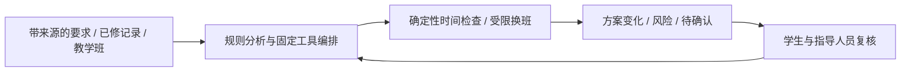

# OPC 评委版介绍与演示草稿

> 2026-10-06 PR51/PR52交叉审计更新：[权威truth table](OPC_CROSS_PR_TRUTH_TABLE.md)。下文基于main c75b6da的原库存为历史基线；PR51已补README、演示脚本、架构图、启动和恢复指南，不再列为缺失。当前尚需修正来源/计算话术与LEVEL2说明，并完成成品视频、slides、截图、赛规核对及彩排。以truth table的Mode1回放/Mode2实际计算及Planner受限能力为最新口径。

日期2026-10-06；基线main c75b6da。本文件是可供负责人批准的讲稿草稿，未完成视频/截图/彩排。不得把推荐演示说成已经现场跑通。当前默认Mock UI与Synthetic生产链路证据不是同一类输出。

## 一句话与30秒pitch

一句话：**学航·转衔：面向转专业学生的学业路径重构原型（固定工具编排，AI增强待接入）。**

30秒：

> 转专业后，学生面对的不只是缺哪门课，还要确认已修能否认定、哪些是历史缺口，以及补修能否放进当前课表。学航·转衔把这三步串起来：规则生成任务，确定性检查给出受限调整建议，未知和风险留给人确认。本次用明确标识的合成输入展示代码链路；模型理解与检索能力尚未上线。

1分钟版本：

> 一名转专业学生看到新培养方案，最难的不是查询课程，而是把旧专业已修、新专业要求和自己的课表对上。学航·转衔先按有出处的输入规则区分历史缺口与未来安排，再把任务、教学班、当前课表和结构化偏好交给规划器。我们保留原课表，检查已知时间冲突，提供受限换班建议；缺排课、认定和规则不清楚时明确显示待确认。当前是工具编排原型，尚未接入模型理解或GraphRAG，不是自动选课系统。比赛演示采用公开可复现的合成样例，展示确定性代码链路和风险边界；真实学校完整数据与用户效果仍待验证。

## 200–300字项目简介草稿（中文；字数按实际portal再调整）

学航·转衔面向转专业学生，解决旧专业已修课程、新专业培养要求与当前课表之间的衔接问题。系统按有出处的输入规则识别历史补修范围，保留课程认定和先修信息中的不确定项，再通过确定性时间约束检查与受限换班修复给出建议，展示变化、风险及待确认事项。当前实现了文件读取、课程匹配、固定工具编排、本地规划接口与演示页面；偏好以结构化表单输入，模型理解、RAG和GraphRAG尚未上线。演示使用明确标识的合成样例，生产代码链路经过自动测试，尚未完成真实学校全量数据端到端验收。项目不替代正式课程认定、不保证余量、不自动提交选课，目标是让学生与指导人员共同复核补修方案。

## Synthetic披露：先选择实际展示模式

原推荐“由于North深分页异常，教学班Synthetic，其他全部真实”的话术**不能默认使用**：North历史异常有记录，但既有Synthetic E2E中的Curriculum/学生上下文也是合成输入，默认UI走Mock通道。正式代码执行不等于输入真实。当前无LLM生成解释；风险文案来自确定性结果。

UI一句话（若页面实际运行Synthetic链路）：

> 本演示使用合成样例验证实际代码链路，非实时教务数据，也不代表正式认定或选课结果。

如果展示的是默认Mock页面，UI必须说“本页为Mock演示数据”，不得仅改成Synthetic以显得更真实。此文案是交给Builder的建议，本审计不改UI。

演讲者两句：

> 本次使用明确标识的合成样例，展示培养要求分析、受限规划与风险呈现的实际代码链路；默认Mock页面的预置结果会单独标明。学校完整开课数据尚未取得，North查询历史上出现深分页异常，因此我们不把本演示称为真实全量接入或Real E2E。

README较长版：

> 本项目当前具备本地确定性处理和Synthetic生产代码链路验证能力。比赛演示中的每段材料分别标注Mock展示或Synthetic计算样例；除非附有对应来源和批准证据，不声称Curriculum、学生记录或教学班是真实输入。North开课查询存在历史深分页异常记录，完整五校区验收尚未完成，异常根因未证实，未授权恢复前保持暂停。`POST /api/v1/plan`的端点名称和HTTP200不证明真实来源；只有受控、批准的Curriculum与CourseData证据及完整验收才能谈Real LEVEL2/3。当前偏好、容量、通勤和先修执行口径存在限制，待确认项不会被静默当成已满足，系统不自动选课。正式代码链路与合成输入需分别说明。

若演示另有受控真实Curriculum材料，应逐项记录其digest、输入版本、批准元数据与录制版本，再明确“此段Curriculum真实、教学班Synthetic”；本轮未核验该演示材料，不能先写成事实。

## 4分钟演示：对现有runbook的批评与替代稿

仓库只有DEMO_RUNBOOK的操作步骤，没有可审的逐分钟产品讲稿。下面是建议，不是已有完成脚本。现有手册适合启动排障，不适合给评委顺序朗读：健康检查/分页/SHA会形成死时间；“未装配”与旧版本描述吞掉核心价值；Mock预置结果不能证明点击后重算；XLSX文件选择不能作为自动生成补修的因果起点。

| 时间 | 评委看到 | 理解 / 为什么重要 | 可能追问 | 事实回答与过渡 |
|---|---|---|---|---|
| 0:00–1:00 | 1张虚构学生情境卡、旧/新方案与已修记录、来源标签 | 痛点是认定→历史缺口→排课，而非聊天 | “这些学生数据真实吗？” | 当前展示样例是合成；真实Case A仅另有脱敏统计记录。过渡：“先把历史范围说清楚” |
| 1:00–2:00 | 已批准的录制片段或现有Curriculum CLI样例输出，突出1个待确认项与未来要求区别 | 不把未来正常安排都误算成欠修；不自动认定等价 | “为什么待确认这么多？” | 缺正式认定证据时保留人审，不为了漂亮输出猜结论。过渡：“然后检查能否安排” |
| 2:00–3:00 | 固定合成API样例的实际计算证据，配当前UI可展示的changes/risks/unresolved；清楚分屏标注Mock预置与Synthetic计算 | 展示受限时间检查/换班与未知；证明是代码输出而非编故事 | “是用户上传后实时生成的吗？” | 当前fixed Case A运行，generic上传未串入；不假装统一上传闭环。过渡：“方案还保留哪些限制？” |
| 3:00–4:00 | 1个UNKNOWN/容量人审例子、简单架构图、验证等级与下一步 | 可信拒绝与技术边界；说明人审及价值 | “学校接入/AI/最优都完成了吗？” | 未完成真实全量接入、LLM或全局优化；已验证本地编排和确定性受限处理。用清晰下一步收尾 |

压缩到3分钟：每段45秒，保留来源披露、人审和一次真实代码执行证据。扩展到5分钟：加45秒完整问题与15秒收尾，不展示学校登录/等待分页。不要在镜头中pip install、跑全部测试、追查600或现场改env。30秒pitch避免讲SHA/Protocol/CP-SAT；附录问到再讲。

**必须先验证素材的真实性**：有动态计算就保留输入、命令、输出/HTTP证据；只有Mock页面，就明确是预置展示，不说用户修改偏好后结果自动重算。既有synthetic测试证明API wiring，不自动证明当前浏览器页面整段贯通。彩排负责人应选择实际跑通的路线，若无法形成连贯4分钟故事，应承认产品提交仍未就绪。

## 5页slides / 单页架构

1. 用户痛点：转专业后的三个问号，配一句话。
2. 流程：有出处的要求→历史缺口/人审→排课检查→变化/风险，附合成披露。
3. 演示：一次受限修复和一次未知/人审；只展示已录制且有证据的结果。
4. 架构：下图；“当前已实现”与“模型能力待建设”分开。
5. 验证与边界：LEVEL1、用例与回归来源、未完成项、下一步验证，不宣称用户收益已测得。

架构slide主图只放4个框与一条审批回路：

slide旁边两列：

- 当前确定性系统：课程匹配与历史范围、已知时间冲突、受限换班、风险/待确认输出。偏好输入并不代表全部执行。
- AI/模型方向（未上线）：理解文档/自然语言偏好、检索有出处的证据、辅助解释。不要画成当前执行的LLM箭头，也不把固定编排说成自主推理。

附录放：Provider边界、SQLite immutable acceptance/read snapshot、ready与partial_ready、请求错误分类、XLSX安全限制、Case A计数口径、Planner未覆盖的规则、验收等级、隐私与权限。主slide不放所有内部模块/枚举/SHA/数据库表，也不把技术建议列表当依赖清单。

## 视频与故障计划

先锁录制版本和合成fixture，确认端点实际可用；两次完整彩排后录4分钟主片与不剪辑的备用操作片，注明是录制结果而非现场实时计算。画面保持来源标签、时间与结果；不展示真实学生表、浏览器认证、路径中的身份信息。录制后检查字幕/音量/时长/隐私与链接。截图至少4张：用户情境、历史范围/人审、建议变化、风险/来源。

现场故障优先播放已披露的备份视频；保留Mock UI展示能力，不悄悄换成“真实成功结果”。不要以学校现场联网为比赛关键路径；官方平台是否要求联网demo或固定视频格式仍须负责人核对。
